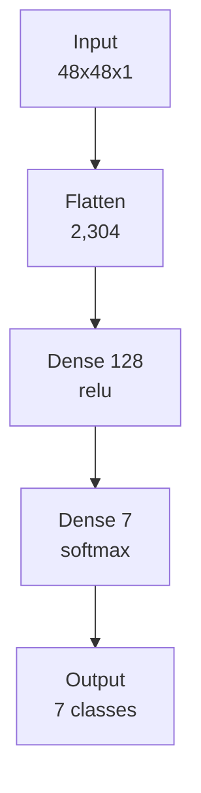
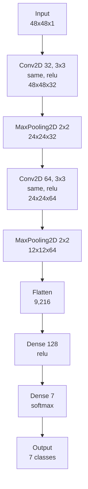

# TDSE_NeuralNetwork

**Mariana Malagón Tochoy**

## Problem Description

This project is an assignment for my digital transformations course, and the focus isn't on squeezing out the highest possible accuracy. It's on treating convolutional layers as an architectural choice I have to understand and justify, not a black box I import and call.

I compare two models on the same facial emotion classification task: a baseline neural network with no convolutional layers (Flatten + Dense), and a convolutional neural network I designed myself. The goal is to measure, with real numbers, what convolution actually buys me on this problem, and to reason about why.

The full analysis, code, and experiments are in [`neuralNetworks_emotion_classification.ipynb`](neuralNetworks_emotion_classification.ipynb).

## Dataset Description

I used **FER2013** (Facial Expression Recognition 2013), downloaded from Kaggle (`msambare/fer2013`, a standalone dataset, not a competition). It has:

- 7 emotion classes: angry, disgust, fear, happy, neutral, sad, surprise
- 35,887 images total (28,709 train, 7,178 test), already split into `train/` and `test/` folders by emotion
- 48x48 grayscale images, single channel, `uint8` pixel values from 0 to 255
- A real class imbalance: "disgust" has only 436 training images, versus 7,215 for "happy"

I picked this dataset because what actually separates one emotion from another is a handful of local features, the shape of the eyebrows, how open the eyes are, the curve of the mouth, and those features don't sit in the same pixels across images, since every photo is a different person at a slightly different angle. That's exactly the kind of structure convolution is built to exploit: a filter that learns to detect a pattern like a furrowed eyebrow can recognize it anywhere in the image, instead of having to relearn it separately for every possible position. The full reasoning is in the notebook's "Why FER2013 Fits a Convolutional Approach" section.

The dataset itself isn't committed to this repo (it's in `.gitignore`), since it's thousands of image files. To reproduce this notebook, download it from Kaggle and place it at `data/train/<emotion>/` and `data/test/<emotion>/`.

## Architecture

### Baseline (non-convolutional)

Total params: 295,943

### CNN (convolutional)

Total params: 1,199,495

The dense head (`Dense(128, relu) -> Dense(7, softmax)`) is identical in both models, on purpose, so any accuracy difference between them can be attributed to the convolutional layers, not to a different classifier on top. Every design choice in the CNN (kernel size, filter counts, stride, padding, activation, pooling) is justified in the notebook's "Convolutional Architecture Design" section.

## Experimental Results

| Model | Parameters | Test accuracy |
|---|---|---|
| Baseline (Flatten + Dense) | 295,943 | 38.29% |
| CNN, with pooling | 1,199,495 | 51.87% |
| CNN, without pooling | 18,894,215 | 46.60% |

The baseline tops out around 38% test accuracy and starts overfitting from about epoch 10 onward (training accuracy keeps climbing while validation plateaus and drops).

For the controlled experiment (section 4 of the notebook), I picked pooling as the one aspect of the convolutional layer to test, comparing the CNN above against an identical version with both `MaxPooling2D` layers removed. Removing pooling made the model 15.7 times heavier and about 5 times slower per epoch, and it still did worse: 46.60% vs 51.87% test accuracy. Without pooling, training accuracy rockets to 99% within a few epochs while validation loss climbs past 3.7, a clear case of the extra capacity going into memorizing training images instead of learning patterns that generalize. Pooling costs nothing in complexity, it removes parameters, and it won on every axis I measured: accuracy, training time, and model size.

## Interpretation

**Why did convolution outperform the baseline?** FER2013's emotion signal lives in local features whose exact pixel position varies from photo to photo. The baseline's dense layer needs a separate weight for every pixel position, so it can't recognize a pattern showing up somewhere it hasn't seen before. The CNN's filters are reused across every position in the image, so a pattern learned once can be detected anywhere. That match between the architecture's assumptions and the dataset's actual structure is what produced the ~14 percentage point accuracy gap.

**What inductive bias does convolution introduce?** Three, baked into the architecture before it ever sees data: locality (nearby pixels are assumed more related than distant ones, so filters only look at small neighborhoods), translation invariance through parameter sharing (the same filter weights apply everywhere, so a pattern means the same thing regardless of position), and hierarchical composition (stacked layers assume complex patterns are built out of simpler ones, edges into curves into shapes).

**When would convolution not be appropriate?** When those assumptions don't hold. Tabular data without spatial structure (age, income, zip code) has no meaningful "neighbor" relationship for locality to exploit. Problems where position itself carries meaning that shouldn't be shared work against translation invariance. And problems dominated by long-range relationships between distant parts of the input are a poor fit for convolution's local receptive fields, that's part of why attention-based architectures tend to do better on tasks like long-document language understanding.

The full version of this section, with more detail and direct ties to the notebook's own results, is in the notebook itself.

## Deployment

Training and deployment to a Sagemaker endpoint is in progress.